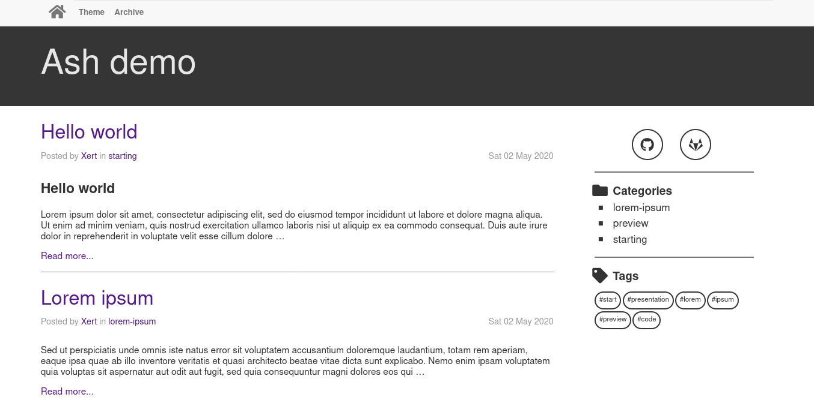
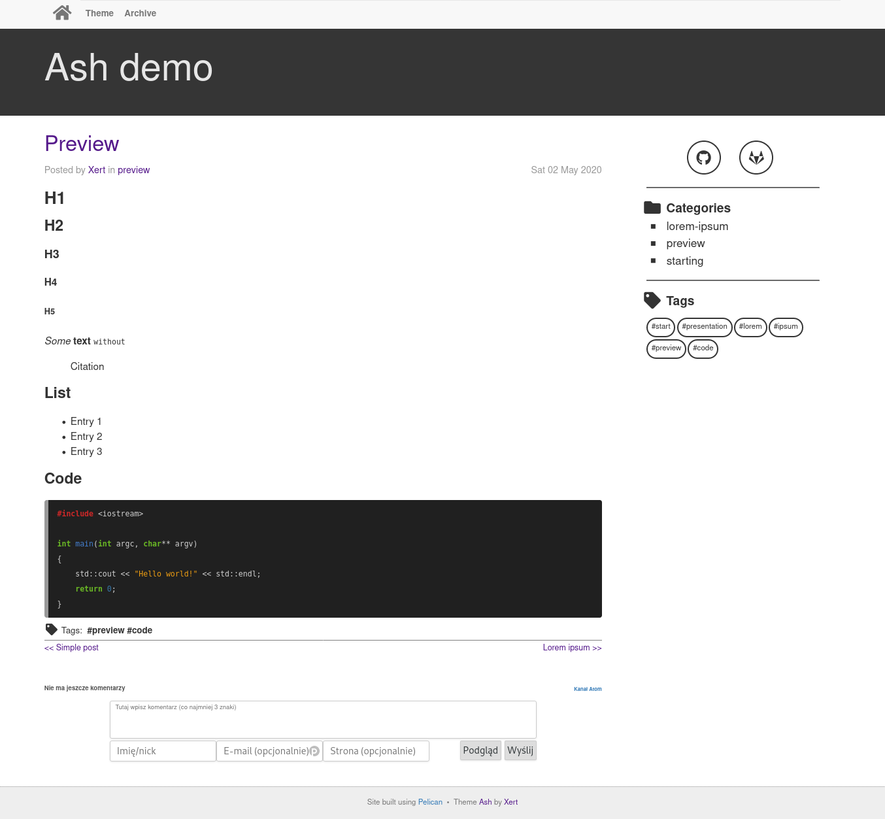

## Ash
<a target="_blank" href="LICENSE" title="License: MIT"></a>
<br/>
Ash is a simple theme for the [pelican](https://github.com/ametaireau/pelican) static page generator. Layout is fully responsive and use mobile first approach. 

Theme is designed without using Javascript (just HTML & CSS). 

### Features

* Mobile first
* Responsive design
* No JS
* OpenGraph support
* Code highlight support
* Pagination support
* Support for RSS/ATOM feed
* Customizable top menu & sidebar

### Plugin support
- [Neighbors](https://github.com/getpelican/pelican-plugins/tree/master/neighbors)

### Integrations
- [Isso](https://posativ.org/isso/)

### Install

* Clone the repo 
* Set its location using THEME option in pelicanconf.py.
* Provide font-awesome css via FONT_AWESOME_LINK
### Configuration
```python
#Font awesome
FONT_AWESOME_LINK = "https://url-to-font-awesome"

#### Sidebar

#Enable/disable sidebar
SIDEBAR = True 

#Custom sidebar sections
SIDEBAR_MODULES = ( "taglist.html", )

#Social icons (github, gitlab, linkedin, etc.)
SOCIAL = (
              ('github', 'https://github.com/some-account', 'fab fa-github fa-fw fa-lg'),
              ('gitlab', 'https://gitlab.com/some-account', 'fab fa-gitlab fa-fw fa-lg'),
     	 )

#### Top navbar

#Custom links
MENUITEMS = (
              ('Interesting page', 'https://url-to-interesting-page'),
     	 )

#### Other

#OpenGraph support
USE_OPEN_GRAPH = True

#Neighbors support (when neighbors plugin enabled)
PREV_NEXT_ENABLE = True

#Article custom footer
ARTICLE_CUSTOM_FOOTERS = ("isso_comments.html",)

#Isso URL (isso_comments article footer must be enabled)
ISSO_URL = "https://issourl"

```

### Screenshots




### License
MIT © Xert


​    
